# Champions Deck: Esports Tournament Management System


## Overview

Champions Deck is a robust desktop application designed to facilitate the end-to-end management of esports tournaments. Developed using C# Windows Forms and SQL Server, the system provides a secure, role-based environment for organizing tournaments, managing teams and matches, and administering users. Champions Deck is engineered to support the dynamic needs of esports organizations, ensuring efficient operations and a seamless experience for all stakeholders.

---


## Key Features

- **Role-Based Access Control:**  
  Distinct modules for Admins, Tournament Managers, Game Managers, and Viewers, each with tailored permissions and workflows.

- **Tournament Lifecycle Management:**  
  Create, propose, approve, and monitor tournaments; manage team registrations, match scheduling, and score updates.

- **Game Administration:**  
  Add, update, or remove games available for tournaments, managed by dedicated Game Managers.

- **User Management:**  
  Admins oversee all user accounts, approve tournaments, and maintain system integrity.

- **Viewer Portal:**  
  Viewers can register, verify their accounts, and browse ongoing and upcoming tournaments.

- **Secure Data Handling:**  
  All sensitive operations are protected by authentication and authorization mechanisms.

---

## System Architecture

- **Frontend:**  
  C# Windows Forms application providing an intuitive and responsive user interface.

- **Backend:**  
  SQL Server database supporting all CRUD operations and enforcing data integrity.

- **Authentication:**  
  Role-based login system with password management and email verification for viewers.

---

## User Roles & Responsibilities

| Role                | Responsibilities                                                                                 |
|---------------------|--------------------------------------------------------------------------------------------------|
| **Admin**           | Manage all users, approve tournaments, oversee permissions, and ensure system integrity.          |
| **Tournament Manager** | Organize tournaments, manage teams, schedule matches, and update scores.                       |
| **Game Manager**    | Administer games available for tournaments.                                                      |
| **Viewer**          | Register, verify account, and browse tournaments (read-only access).                             |

---

## Database Schema

Champions Deck utilizes a normalized SQL Server schema to ensure data consistency and scalability.  
The schema includes tables for users, admins, game managers, tournament managers, viewers, games, teams, team members, tournaments, matches, and players.

**For full table definitions, refer to [`query.txt`](query.txt).**

---

## Screenshots

## Screenshots

Explore the core features and workflows of Champions Deck through the following screenshots:

### Authentication & Onboarding
- **Login:**  
    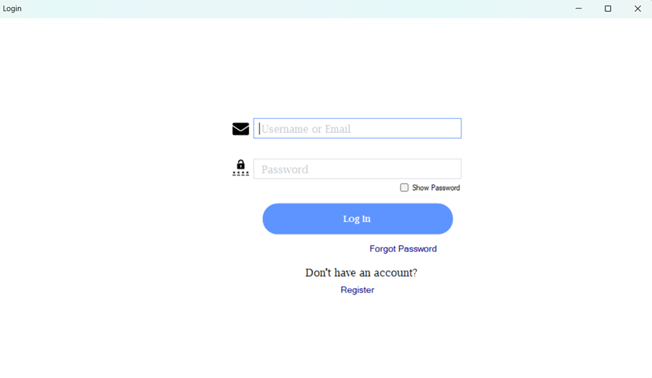
- **Registration:**  
    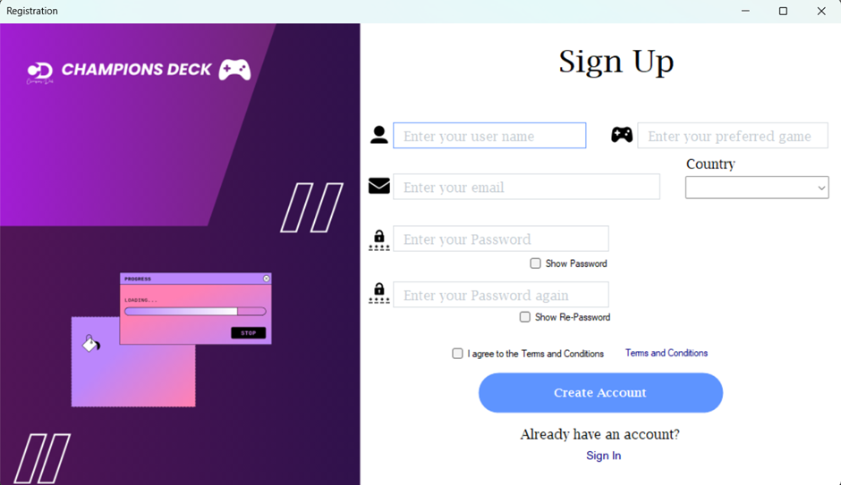
- **Email Verification:**  
    
- **Change Password:**  
    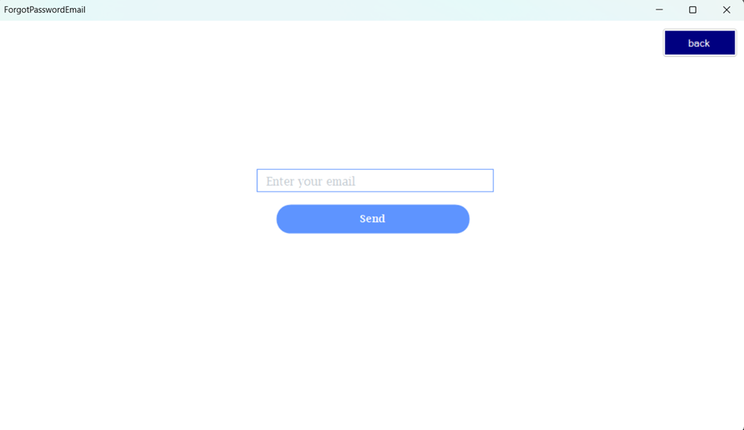  
    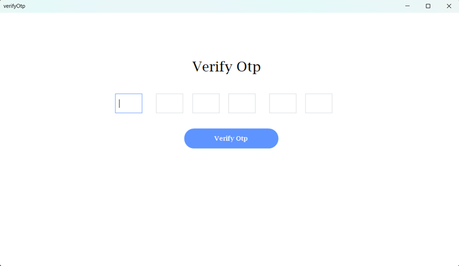  
    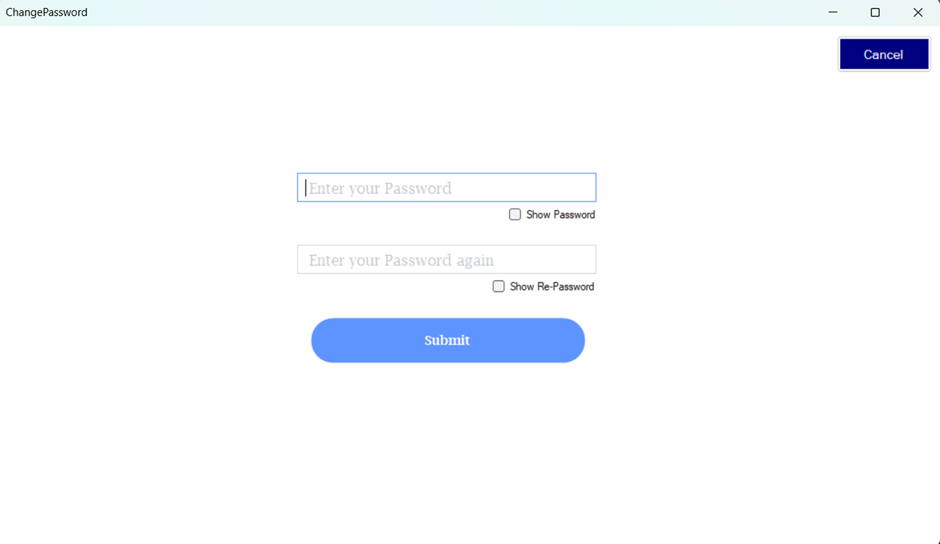

### Tournament Experience
- **Browse Tournaments:**  
    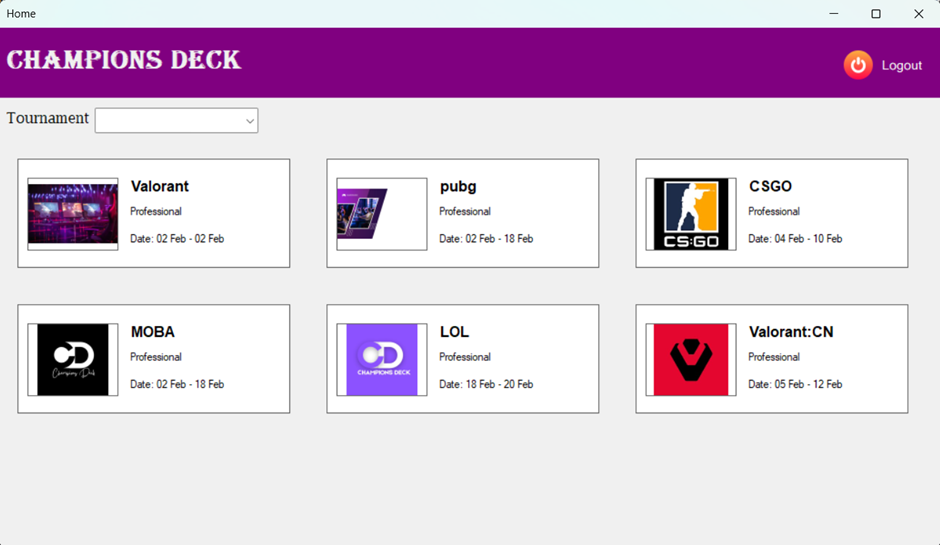
- **Propose & Approve Tournaments:**  
    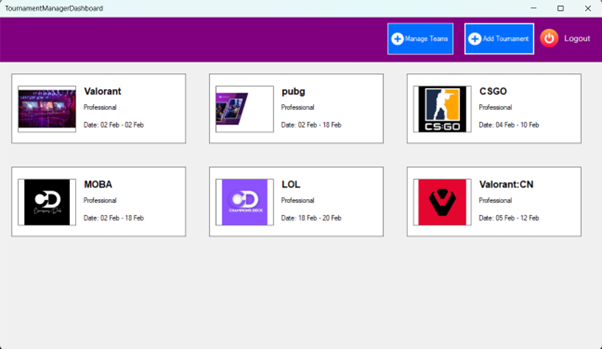  
    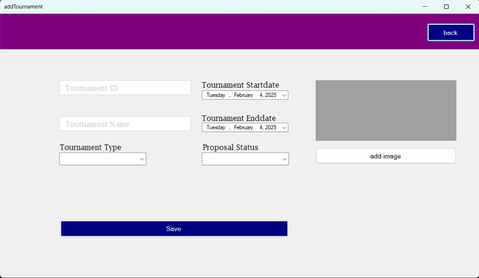

### Management Dashboards
- **Game Management:**  
    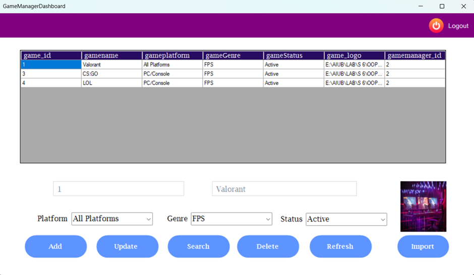
- **Team Management:**  
    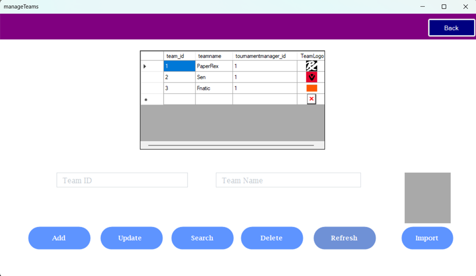
- **Match Scheduling & Score Updates:**  
    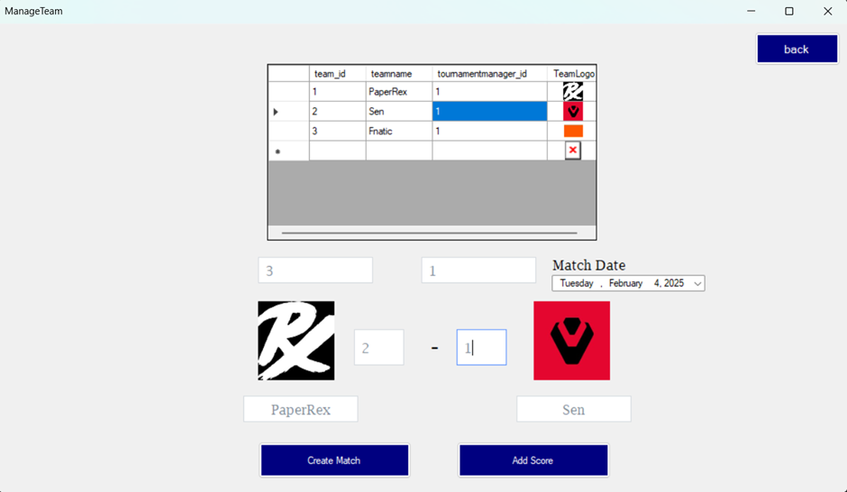

### Administration
- **Admin Overview:**  
    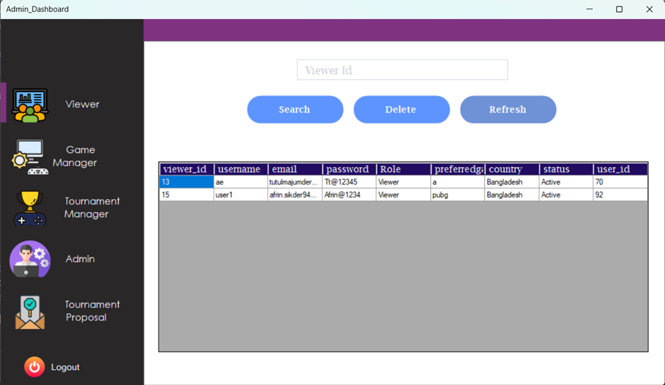
- **User Management:**  
    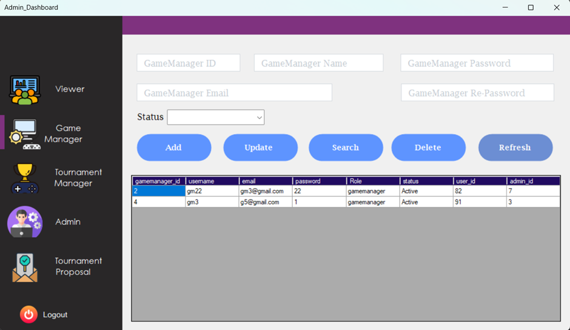
- **Tournament Approval:**  
    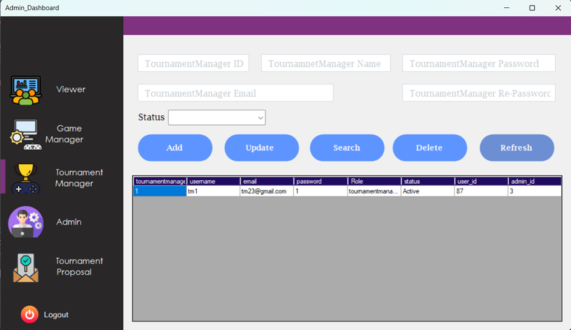
- **System Settings:**  
    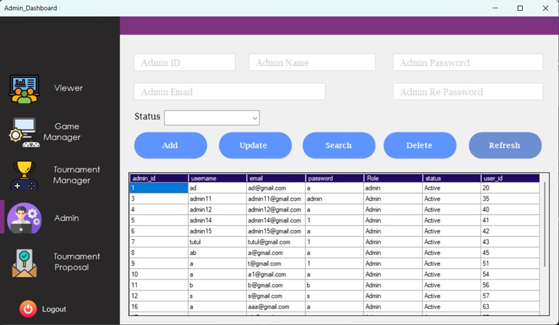
- **Audit Logs:**  
    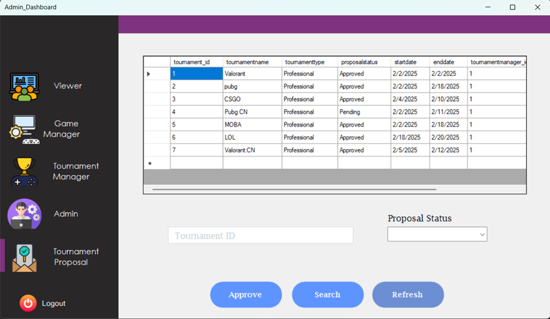

*Note: Screenshots are for demonstration purposes and may differ from the final application UI.*

## Prerequisites

- Visual Studio (with C# .NET support)
- SQL Server (Express or higher)
- SQL Server Management Studio (SSMS)

---

## Setup Instructions

1. **Clone the repository:**
   ```sh
   git clone https://github.com/your-username/champions-deck.git
   cd champions-deck
   ```

2. **Import the database schema:**  
   Use SSMS to execute the SQL queries from [`query.txt`](query.txt) in your SQL Server instance.

3. **Open the project in Visual Studio.**

4. **Build and run the solution.**

---

## Requirements

- Windows 10/11
- .NET Framework 4.7.2 or later
- SQL Server (Express or higher)
- Visual Studio 2019 or later

---

## License

Champions Deck is released under the MIT License.

---

## Contact

For support or inquiries, please contact the project maintainer at [majumder.tutul.364@gmail.com](mailto:majumder.tutul.364@example.com).

---
